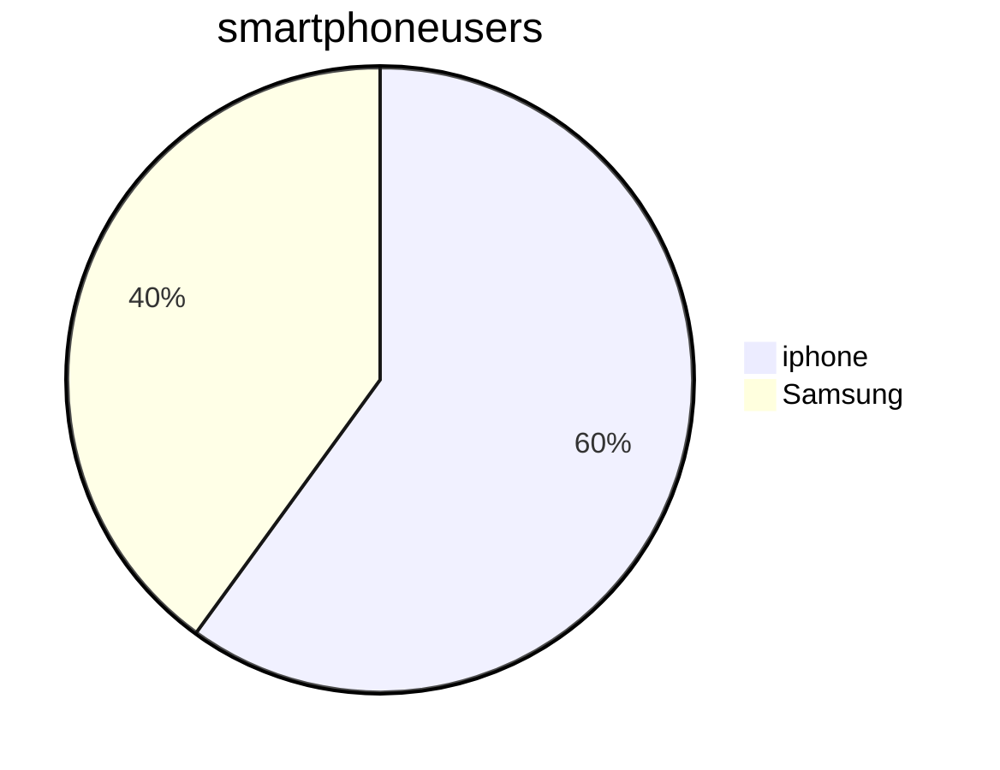

<br>

# This is a h1 header

## This is a h2 header

### This is a h3 header

This is plain text

*This is in italics*

_This is in italics_

**This is in bold**

> This is the quote
> > Arnold S

## Lists
* item 1
  1. subitem 1
  2. subitem 2
* item 2
  * subitem 1
  * subitem 2

## Numbered Lists
1. Item 1
2. Item 2
3. Item 3


[Google](https://google.com)

## Marking as code

This is how you print hello to the screen in Python

```python
print('Hello')
```

Name    |   Street   |  Town
--------|------------|----------
Cathy   | Main St    | Birmingham
John    | Maple Drive  | Stafford

